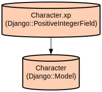

# Django Game-Based Todo List API with Character Progression System

A Django REST API that gamifies task management by combining todo list functionality with RPG character progression. Users complete tasks to earn experience points (XP) and gold, level up their characters, and customize their appearance with purchasable items.

The project implements a comprehensive user management system with JWT authentication, character progression mechanics, and an inventory system. It features a robust data model that tracks user tasks, character stats, items, and character customization options. The API supports task completion rewards, item purchases, and character appearance management through an intuitive REST interface.

## Repository Structure
```
.
├── manage.py                    # Django CLI management script
├── myproject/                   # Main project configuration
│   ├── settings.py             # Project settings including JWT, database, and security configs
│   ├── urls.py                 # Main URL routing configuration
│   └── wsgi.py                 # WSGI server configuration
├── requirements.txt            # Project dependencies
└── todoDataBase/              # Main application package
    ├── admin.py               # Django admin interface configuration
    ├── authentication.py      # Custom email authentication backend
    ├── migrations/            # Database migration files
    ├── models.py             # Data models for users, characters, items, and tasks
    ├── serializers.py        # API serializers for data transformation
    ├── urls.py               # Application-specific URL routing
    └── views.py              # API view logic and endpoint handlers
```

## Usage Instructions
### Prerequisites
- Python 3.9 or higher
- PostgreSQL database server
- pip (Python package manager)

Required system packages:
```bash
# For PostgreSQL support
sudo apt-get install python3-dev libpq-dev postgresql postgresql-contrib  # Debian/Ubuntu
brew install postgresql  # macOS
```

### Installation

1. Clone the repository:
```bash
git clone <repository-url>
cd <repository-name>
```

2. Create and activate a virtual environment:
```bash
# MacOS/Linux
python3 -m venv venv
source venv/bin/activate

# Windows
python -m venv venv
.\venv\Scripts\activate
```

3. Install dependencies:
```bash
pip install -r requirements.txt
```

4. Configure PostgreSQL:
```bash
# Create database and user
sudo -u postgres psql
postgres=# CREATE DATABASE mydb;
postgres=# CREATE USER todolist WITH PASSWORD 'ADmiN123';
postgres=# ALTER ROLE todolist SET client_encoding TO 'utf8';
postgres=# ALTER ROLE todolist SET default_transaction_isolation TO 'read committed';
postgres=# ALTER ROLE todolist SET timezone TO 'UTC';
postgres=# GRANT ALL PRIVILEGES ON DATABASE mydb TO todolist;
```

5. Apply migrations:
```bash
python manage.py migrate
```

6. Create a superuser:
```bash
python manage.py createsuperuser
```

### Quick Start
1. Start the development server:
```bash
python manage.py runserver
```

2. Register a new user:
```bash
curl -X POST http://localhost:8000/api/register/ \
  -H "Content-Type: application/json" \
  -d '{"email": "user@example.com", "password": "yourpassword"}'
```

3. Login to get JWT tokens:
```bash
curl -X POST http://localhost:8000/api/login/ \
  -H "Content-Type: application/json" \
  -d '{"email": "user@example.com", "password": "yourpassword"}'
```

### More Detailed Examples

1. Create a new task:
```bash
curl -X POST http://localhost:8000/api/tasks/ \
  -H "Authorization: Bearer <your-access-token>" \
  -H "Content-Type: application/json" \
  -d '{"title": "Complete project", "description": "Finish the API documentation", "reward_xp": 50, "reward_gold": 100}'
```

2. Complete a task and earn rewards:
```bash
curl -X POST http://localhost:8000/api/tasks/{task_id}/complete/ \
  -H "Authorization: Bearer <your-access-token>"
```

### Troubleshooting

1. Database Connection Issues
- Error: "could not connect to server: Connection refused"
  - Check if PostgreSQL service is running:
    ```bash
    # Linux
    sudo service postgresql status
    # macOS
    brew services list
    ```
  - Verify database credentials in settings.py

2. JWT Token Issues
- Error: "Token is invalid or expired"
  - Check token expiration time in settings.py (currently 40 minutes)
  - Use refresh token endpoint to get new access token:
    ```bash
    curl -X POST http://localhost:8000/api/token/refresh/ \
      -H "Content-Type: application/json" \
      -d '{"refresh": "<your-refresh-token>"}'
    ```

## Data Flow
The application follows a task-based progression system where user actions trigger character advancement.

```ascii
User Action -> Task Completion -> Character Update
     │                │                │
     └─► Create Task  └─► XP & Gold   └─► Level Up
                          Rewards         & Inventory
```

Component interactions:
1. User authentication through JWT tokens manages session state
2. Task completion triggers reward calculation and distribution
3. Character stats (XP, gold) update based on completed tasks
4. Inventory system tracks purchased items and equipment
5. Character appearance updates reflect equipped items
6. Database transactions ensure data consistency across actions
7. API endpoints validate user permissions and resource access

## Infrastructure


The application uses PostgreSQL with the following configuration:
- Database Name: mydb
- User: todolist
- Authentication: Password-based
- Host: localhost
- Encoding: UTF-8
- Timezone: UTC

Security features:
- JWT token authentication with 40-minute access token lifetime
- Token refresh mechanism with 7-day refresh token lifetime
- Token blacklisting for logout functionality
- CORS configuration for frontend integration