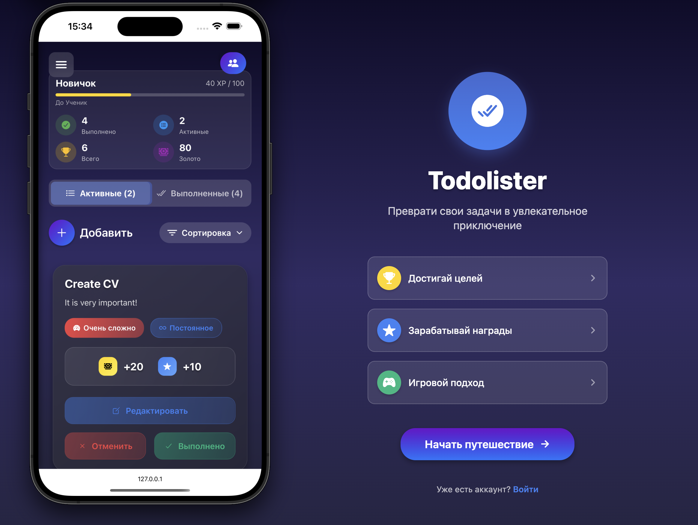
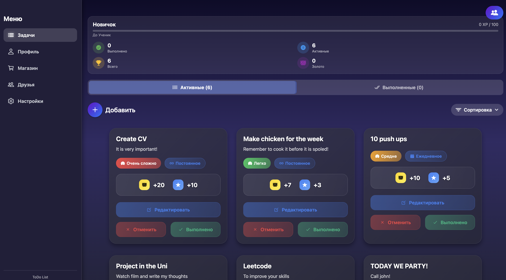
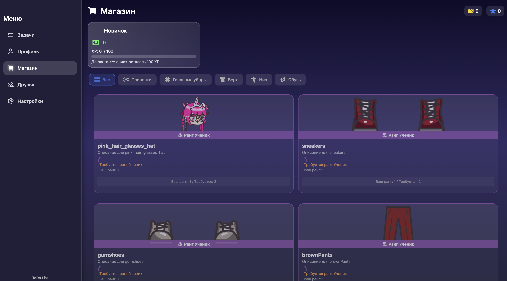
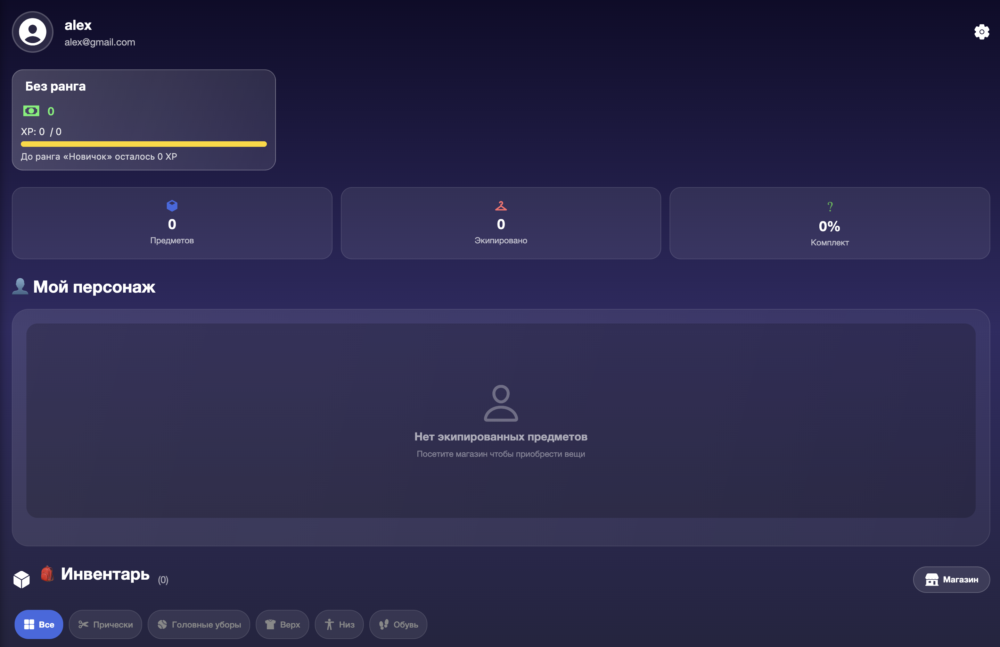
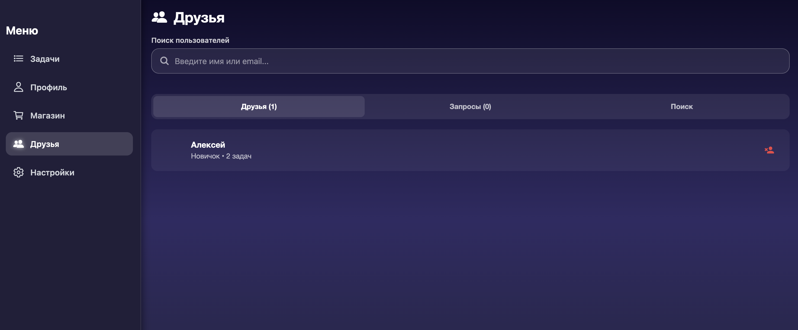

# TodoLister - Gamified Task Management Application

A full-stack mobile-first application that transforms mundane task management into an engaging gaming experience. Built with Django REST Framework backend and React Native (Expo) frontend, featuring character progression, rewards systems, and social collaboration.



## 🎯 Project Overview

TodoLister addresses the challenge of task management motivation by incorporating game mechanics that reward users for productivity. Users earn experience points and virtual currency for completing tasks, which can be used to customize their avatar and unlock new features.

### Key Achievements
- ✨ **Gamification System** - Complete reward and progression mechanics
- 🤝 **Social Features** - Friends system with collaborative tasks
- 📱 **Cross-Platform** - React Native app with web deployment
- 🔐 **Secure Architecture** - JWT authentication with refresh tokens
- 🎨 **Character Customization** - Dynamic avatar system with unlockable items

## 🚀 Features

### Core Functionality
- ✅ **Task Management** - Create, edit, complete tasks with difficulty levels
- 🎮 **Gamification System** - Earn XP and gold based on task difficulty
- 📈 **Rank Progression** - Level up through rank tiers (Новичок → Легенда)
- 🛍️ **Virtual Shop** - Purchase character customization items
- 👥 **Social Features** - Add friends and collaborate on tasks
- 🤝 **Task Collaboration** - Invite friends to work on tasks together

### Technical Highlights
- 🔐 **JWT Authentication** - Secure login with automatic token refresh
- 📱 **React Native/Expo** - Cross-platform mobile application
- 🎨 **Dynamic Avatars** - Real-time character customization system
- 💾 **PostgreSQL Database** - Robust data persistence with migrations
- 🔄 **RESTful API** - Clean, scalable backend architecture
- 🖼️ **Media Management** - Image upload and serving system

## 🛠 Tech Stack

### Backend
- **Python 3.8+** - Core programming language
- **Django 4.2** - Web framework with built-in security
- **Django REST Framework** - API implementation
- **PostgreSQL** - Primary database
- **JWT Authentication** - djangorestframework-simplejwt
- **WhiteNoise** - Static file serving
- **Pillow** - Image processing
- **CORS Headers** - Cross-origin resource sharing

### Frontend
- **React Native** - Cross-platform mobile framework
- **Expo** - Development and deployment platform
- **Expo Router** - File-based navigation
- **AsyncStorage** - Local data persistence
- **Linear Gradient** - Modern UI styling
- **React Native Paper** - Material Design components
- **Toast Messages** - User notifications

### Development & Deployment
- **Git** - Version control
- **Render** - Backend deployment
- **Expo** - Mobile app deployment
- **Environment Variables** - Configuration management

## 📸 Application Screenshots

<div align="center">

| Task Management | Shop & Customization |
|:---:|:---:|
|  |  |

| Character Customization | Friend List & Collaboration |
|:---:|:---:|
|  | 

</div>

## 🏗 Architecture & Implementation

### System Design
```
React Native ↔ REST API (Django) ↔ PostgreSQL Database
        ↕                    ↕                    ↕
   AsyncStorage      JWT Authentication    Media Storage
```

### Database Schema
- **User Model** - Extended with XP, gold, and avatar fields
- **Task System** - Difficulty-based rewards with collaboration support
- **Inventory System** - Item ownership and equipment tracking
- **Shop Economy** - Rank-gated items with pricing logic
- **Social Features** - Friends and task collaboration models

### API Architecture
```python
/api/tasks/              # Task CRUD and completion
/api/character/          # Character progression and customization
/api/shop/              # Virtual economy and purchases
/api/user/              # Profile management and avatars
/api/friendships/       # Social features
/api/collaboration/     # Task collaboration system
```

## 🚀 Getting Started

### Prerequisites
- Python 3.8+
- Node.js 16+
- PostgreSQL
- Expo CLI (`npm install -g @expo/cli`)

### Backend Setup
```bash
# Clone repository
git clone https://github.com/yourusername/todolister.git
cd ToDoLister/backend

# Create virtual environment
python -m venv venv
source venv/bin/activate  # Windows: venv\Scripts\activate

# Install dependencies
pip install -r requirements.txt

# Environment setup
cp .env.example .env  # Configure your database and secret key

# Database setup
createdb tododb_v1
python manage.py migrate
python manage.py loaddata fixtures/initiate_ranks.json
python populate_shop.py  # Populate shop items

# Start development server
python manage.py runserver
```

### Frontend Setup
```bash
cd ../frontend

# Install dependencies
npm install

# Start Expo development server
npx expo start

# Use Expo Go app to scan QR code or run on simulator
```


## 💻 Code Examples

### Backend - Task Completion with Dynamic Rewards
```python
class TaskViewSet(viewsets.ModelViewSet):
    @action(detail=True, methods=['post'])
    def complete(self, request, pk=None):
        task = self.get_object()
        
        # Dynamic reward calculation based on difficulty
        difficulty_multiplier = {
            1: 0.5,   # Very Easy
            2: 0.75,  # Easy  
            3: 1.0,   # Medium
            4: 1.5,   # Hard
            5: 2.0    # Very Hard
        }
        
        user = request.user
        user.xp += task.reward_xp
        user.gold += task.reward_gold
        user.save()
        
        task.is_completed = True
        task.save()
        
        return Response({
            'status': 'Task completed',
            'rewards': {
                'xp': task.reward_xp,
                'gold': task.reward_gold
            }
        })
```

### Frontend - Character Customization
```jsx
const CharacterCustomization = () => {
  const [character, setCharacter] = useState(null);
  
  const changeItem = async (inventoryItemId) => {
    try {
      const response = await fetch('/api/character/change-item/', {
        method: 'POST',
        headers: {
          'Authorization': `Bearer ${token}`,
          'Content-Type': 'application/json'
        },
        body: JSON.stringify({ inventory_item_id: inventoryItemId })
      });
      
      const data = await response.json();
      setCharacter(data.character);
      
      Toast.show({
        type: 'success',
        text1: 'Item equipped!'
      });
    } catch (error) {
      console.error('Error changing item:', error);
    }
  };
  
  return (
    <View style={styles.characterContainer}>
      {/* Character display and item selection */}
    </View>
  );
};
```

## 🔧 API Endpoints

| Method | Endpoint | Description | Authentication |
|--------|----------|-------------|----------------|
| POST | `/api/register/` | User registration | Public |
| POST | `/api/login/` | User login | Public |
| POST | `/api/token/refresh/` | Refresh JWT token | Public |
| GET | `/api/tasks/` | Get user tasks | JWT Required |
| POST | `/api/tasks/` | Create new task | JWT Required |
| POST | `/api/tasks/{id}/complete/` | Complete task | JWT Required |
| GET | `/api/character/get-character/` | Get character data | JWT Required |
| POST | `/api/character/change-item/` | Equip character item | JWT Required |
| GET | `/api/shop/` | Get shop items | JWT Required |
| POST | `/api/shop/{id}/purchase/` | Purchase shop item | JWT Required |
| GET | `/api/friendships/` | Get friends list | JWT Required |
| POST | `/api/friend-requests/` | Send friend request | JWT Required |
| POST | `/api/collaboration-invitations/send-invitation/` | Invite to collaborate | JWT Required |

## 🎯 Technical Challenges & Solutions

### Challenge 1: Dynamic Character Customization
**Problem:** Managing complex item equipping logic where hair/headwear items conflict with each other but not with other item types.

**Solution:** Implemented smart inventory management in the `Inventory.save()` method that automatically unequips conflicting items based on type relationships.

### Challenge 2: Collaborative Task System
**Problem:** Designing a system where friends can work together on tasks with different completion requirements.

**Solution:** Created a flexible collaboration system with `TaskCollaborator` model supporting both "anyone can complete" and "everyone must complete" modes.

### Challenge 3: Cross-Platform Authentication
**Problem:** Maintaining secure authentication across React Native app with automatic token refresh.

**Solution:** Implemented JWT with refresh tokens stored in AsyncStorage, with automatic token refresh logic in API calls.


## 📈 Performance & Features

### Performance Metrics
- **App Launch Time:** < 3 seconds on mobile devices
- **API Response Time:** < 200ms for most endpoints
- **Database Queries:** Optimized with select_related and prefetch_related
- **Image Loading:** Lazy loading with caching for character items

### Features 
- ✅ **User Authentication** - Complete with JWT refresh
- ✅ **Task Management** - Full CRUD with difficulty system
- ✅ **Gamification** - XP, gold, and rank progression
- ✅ **Character System** - Avatar customization with shop
- ✅ **Social Features** - Friends and task collaboration
- ✅ **Mobile App** - React Native with Expo


## 🔮 Future Enhancements

### Planned Features
- 🏆 **Leaderboards** - Global and friend rankings
- 📊 **Analytics Dashboard** - Task completion trends and insights
- 🔔 **Push Notifications** - Smart reminders and achievement alerts
- 🌐 **Web Version** - Progressive Web App with offline support
- 🎯 **Achievement System** - Badges and special rewards
- 📅 **Calendar Integration** - Sync with external calendar apps

### Technical Improvements
- ⚡ **Redis Caching** - Improve API response times
- 🔄 **Background Tasks** - Celery for async operations
- 📚 **API Documentation** - Swagger/OpenAPI implementation
- 🧪 **Testing Suite** - Comprehensive unit and integration tests
- 🐳 **Docker Support** - Containerized deployment
- 📱 **Native Apps** - iOS and Android native versions

## 👨💻 Development Insights

This project demonstrates comprehensive full-stack development capabilities:

- **🏗️ System Architecture** - Scalable REST API with proper separation of concerns
- **📱 Mobile Development** - React Native/Expo with cross-platform compatibility
- **🔐 Security Implementation** - JWT authentication with refresh token rotation
- **🎮 Gamification Design** - Engaging user experience through game mechanics
- **👥 Social Features** - Complex friend and collaboration systems
- **🗄️ Database Design** - Optimized PostgreSQL schema with proper relationships
- **🚀 DevOps** - Environment-based configuration and deployment strategies

### Key Learning Outcomes
- Advanced Django REST Framework patterns
- React Native navigation and state management
- Complex database relationships and migrations
- JWT authentication implementation
- Cross-platform mobile development
- API design and documentation


---

<div align="center">

**TodoLister** - Transforming productivity through gamification 🎮

*Built with ❤️ using Django REST Framework and React Native*

</div>