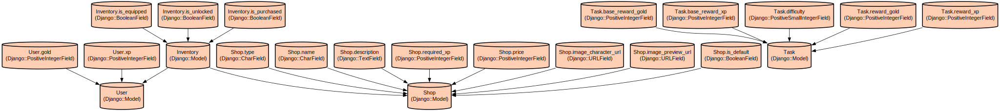

# Django Todo Application with Character Customization and Rewards System

A Django-based todo application that gamifies task management by incorporating character customization, experience points (XP), and in-game currency (gold) rewards. Users can earn rewards by completing tasks and use them to unlock and purchase character customization items.

The application combines productivity with gaming elements to increase user engagement. It features a comprehensive user authentication system, task management with difficulty-based rewards, and a shop system where users can unlock and purchase various character customization items using earned XP and gold. The application uses JWT (JSON Web Tokens) for secure authentication and includes a RESTful API for seamless frontend integration.

## Repository Structure
```
backend_test/
├── docs/                    # Documentation files including infrastructure diagrams
├── manage.py               # Django project management script
├── myproject/             # Main Django project configuration
│   ├── settings.py        # Project settings including DB, auth, and JWT config
│   ├── urls.py            # Main URL routing configuration
│   └── wsgi.py            # WSGI application entry point
├── requirements.txt       # Python package dependencies
├── scripts/
│   └── populate_shop.py   # Script to populate shop items with default data
└── todoDataBase/         # Main application module
    ├── models.py         # Database models for User, Task, Shop, and Inventory
    ├── serializers.py    # API serializers for data transformation
    ├── views.py         # API views and business logic
    └── urls.py          # Application URL routing
```

## Usage Instructions
### Prerequisites
- Python 3.8 or higher
- PostgreSQL 12.0 or higher
- pip (Python package manager)

Required Python packages:
- Django 4.2.20
- djangorestframework
- djangorestframework-simplejwt
- psycopg2-binary
- django-cors-headers

### Installation

1. Clone the repository:
```bash
git clone <repository-url>
cd backend_test
```

2. Create and activate a virtual environment:
```bash
# MacOS/Linux
python3 -m venv venv
source venv/bin/activate

# Windows
python -m venv venv
.\venv\Scripts\activate
```

3. Install dependencies:
```bash
pip install -r requirements.txt
```

4. Configure PostgreSQL:
```bash
# Create database and user
psql -U postgres
CREATE DATABASE tododb_v1;
CREATE USER todolist WITH PASSWORD 'ADmIN123';
GRANT ALL PRIVILEGES ON DATABASE tododb_v1 TO todolist;
```

5. Apply migrations:
```bash
python manage.py migrate
```

6. Populate shop items:
```bash
python scripts/populate_shop.py
```

7. Run the development server:
```bash
python manage.py runserver
```

### Quick Start
1. Register a new user:
```bash
curl -X POST http://localhost:8000/api/register/ \
  -H "Content-Type: application/json" \
  -d '{"email": "user@example.com", "password": "yourpassword"}'
```

2. Create a new task:
```bash
curl -X POST http://localhost:8000/api/tasks/ \
  -H "Authorization: Bearer <your-token>" \
  -H "Content-Type: application/json" \
  -d '{"title": "My first task", "description": "Task description", "difficulty": 3}'
```

### More Detailed Examples

1. Task Management:
```python
# Complete a task and earn rewards
POST /api/tasks/{task_id}/complete/

# Response
{
    "status": "Task completed.",
    "difficulty": "Medium",
    "reward_xp": 15,
    "reward_gold": 10,
    "user": {
        "id": 1,
        "email": "user@example.com",
        "xp": 115,
        "gold": 60
    }
}
```

2. Shop System:
```python
# Unlock an item with XP
POST /api/shop/{item_id}/unlock/

# Purchase an item with gold
POST /api/shop/{item_id}/purchase/
```

### Troubleshooting

1. Database Connection Issues
```bash
# Check PostgreSQL service status
sudo service postgresql status

# Verify database connection settings in settings.py
DATABASES = {
    'default': {
        'ENGINE': 'django.db.backends.postgresql_psycopg2',
        'NAME': 'tododb_v1',
        'USER': 'todolist',
        'PASSWORD': 'ADmIN123',
        'HOST': 'localhost',
        'PORT': '',
    }
}
```

2. JWT Token Issues
- Error: "Token is invalid or expired"
  - Solution: Refresh your token using `/api/token/refresh/`
  - Check token expiration settings in settings.py

3. Media Files Not Loading
- Verify MEDIA_ROOT and MEDIA_URL settings
- Ensure proper file permissions
- Check nginx configuration if using in production

## Data Flow
The application follows a RESTful architecture where tasks, user progress, and character customization are managed through API endpoints.

```ascii
User Request → JWT Auth → API Endpoint → Database
     ↑                                      ↓
     └──────── Response ←─── Serializer ←───┘
```

Component Interactions:
1. User authentication through JWT tokens
2. Task creation and management with automatic reward calculation
3. XP and gold tracking for user progression
4. Shop system with unlock and purchase mechanics
5. Character customization with equipped items tracking
6. Media file handling for character assets
7. Database transactions for maintaining data integrity

## Infrastructure


The application uses the following key infrastructure components:

Lambda Functions:
- None defined in the current infrastructure

Database:
- PostgreSQL database for storing user data, tasks, and shop items

Storage:
- Local file storage for character customization assets
- Media files served through Django's development server

Authentication:
- JWT-based authentication with token refresh mechanism
- Custom email authentication backend